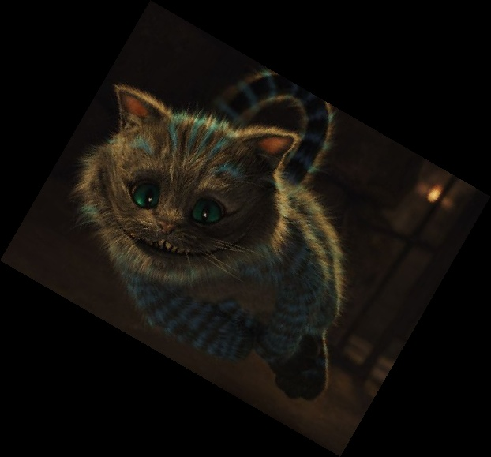
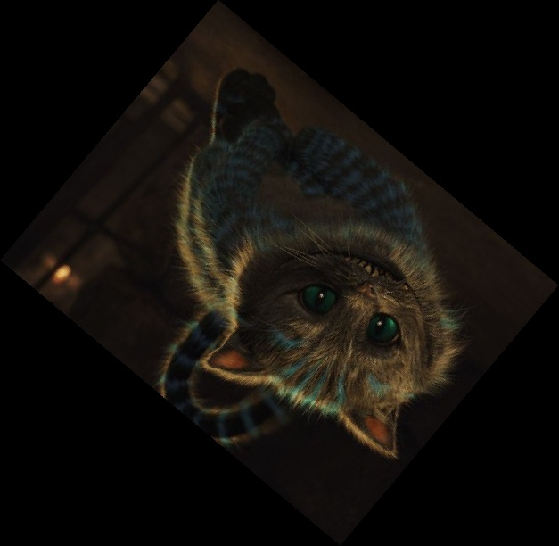

# Application to rotate an image around the center  
Educational task  
Implemented an algorithm for rotating an image at an arbitrary angle using OpenCV.

## Example
Source image  

40 degree rotation  

220 degree rotation  
